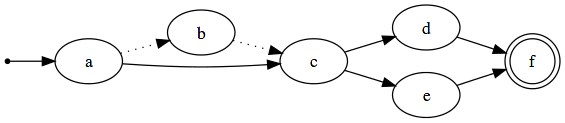

# Tavor [](https://godoc.org/github.com/zimmski/tavor) [](https://travis-ci.org/zimmski/tavor) [](https://coveralls.io/r/zimmski/tavor?branch=master)

Tavor ([Sindarin](https://en.wikipedia.org/wiki/Sindarin) for woodpecker) is a framework for easily implementing and using [fuzzing](#fuzzing) and [delta-debugging](#delta-debugging). Its [EBNF-like notation](#format) allows you to define file formats, protocols, and other structured data without the need to write source code. Tavor relaxes on the definitions of fuzzing and delta-debugging to enable the usage of its algorithms universally for key-driven testing, model-based testing, simulating user-behavior and genetic programming. Tavor is also well-suited for researching new methods without reimplementing basic algorithms.

### <a name="quick-example"></a>A quick example

We want to test a service which processes an XML structure. The structure can contain groups and items. A group contains other groups or items. An Item consists of an attribute `name` with an alphanumeric value. The item's value contains a number. This structure sounds simple but allows an enormous variety of possible outcomes. It is therefore hard to test since a tester has to think about every important possibility if the generation of the test data is done manually. Doing this manually is cumbersome and error-prone. Tavor can be used to automate the generation.

The described structure can be defined using the following [Tavor format](#format):

```tavor
START = Entity |

Entity = Group | Item

Group = "<group>" +(Entity) "</group>"

Item = "<item name=\"" +([\w]) "\">" +([0-9]) "</item>"
```

This file called `basic.tavor` can be downloaded [from here](examples/quick/basic.tavor).

Tavor can then be used to [fuzz](#fuzzing) the format by issuing the following command:

```bash
tavor --format-file basic.tavor fuzz
```

This command prints on every call a random generation of the given structure. Here are some example generations:

```xml
<item name="k">2</item>
```

```xml
<group><item name="kO">37</item></group>
```

```xml
<group><item name="V">37</item><group><item name="S">88</item></group></group>
```

Generating data like this is just one example of the capabilities of Tavor. Please have a look at [the complete example](#complete-example) with a broader overview over the basic features or keep reading to find out more about the background and capabilities of Tavor.

Additionally you can find official Tavor format files and fuzzer applications at [https://github.com/zimmski/fuzzer](https://github.com/zimmski/fuzzer). Announcements<sup>[1](https://groups.google.com/forum/#!msg/golang-nuts/uI6hkmYyaAU/UPz5ccT5_ZgJ)</sup> of the project's progress also include explanations, examples and roadmap information.

## <a name="table-of-content"></a>Table of content

- [What is fuzzing?](#fuzzing)
- [What is delta-debugging?](#delta-debugging)
- [What does Tavor provide and how does it work?](#tavor-provides)
  + [What are tokens?](#token)
  + [What are fuzzing strategies?](#fuzzing-strategy)
  + [What are fuzzing filters?](#fuzzing-filter)
  + [What are reduce strategies?](#reduce-strategy)
  + [Why are loops unrolled?](#unrolling)
- [The Tavor format](#format)
- [A complete example for fuzzing, executing and delta-debugging](#complete-example)
- [Where are the precompiled binaries?](#precompiled)
- [How do I build Tavor?](#build)
- [How do I use Tavor?](#use)
- [The Tavor binary](#binary)
  + [General options](#binary-general)
  + [Command: `fuzz`](#binary-fuzz)
  + [Command: `graph`](#binary-graph)
  + [Command: `reduce`](#binary-reduce)
  + [Command: `validate`](#binary-validate)
  + [Bash Completion](#bash-completion)
- [How do I develop applications with the Tavor framework?](#develop)
  + [Token structures](#develop-token-structures)
  + [Fuzzing filters](#develop-fuzzing-filters)
  + [Fuzzing strategies](#develop-fuzzing-strategies)
  + [Reduce Strategies](#develop-reduce-strategies)
- [How do I extend the Tavor framework?](#extend)
  + [Fuzzing filters](#extend-fuzzing-filters)
  + [Fuzzing strategies](#extend-fuzzing-strategies)
  + [Reduce strategies](#extend-reduce-strategies)
  + [Tokens](#extend-tokens)
  + [Token attributes](#extend-token-attributes)
  + [Typed tokens](#extend-typed-tokens)
- [How stable is Tavor?](#stability)
- [Missing features](#missing-features)
- [Can I make feature requests and report bugs and problems?](#feature-request)

## <a name="fuzzing"></a>What is fuzzing?

> Fuzz testing or fuzzing is a software testing technique, often automated or semi-automated, that involves providing invalid, unexpected, or random data to the inputs of a computer program. The program is then monitored for exceptions such as crashes, or failing built-in code assertions or for finding potential memory leaks. Fuzzing is commonly used to test for security problems in software or computer systems.
> <br/>-- <cite>[https://en.wikipedia.org/wiki/Fuzz_testing](https://en.wikipedia.org/wiki/Fuzz_testing)</cite>

Although this is the common definition of fuzzing, it is nowadays often just one view on capabilities of fuzzing tools. In general, fuzzing is just the generation of data and it does not matter if it is invalid or valid and what the type of data (e.g. files, protocol data) is. The use case of the data itself is also often broadly defined as it can be used to test algorithms, programs or hardware but it can be practically used everywhere where data is needed.

Fuzzing algorithms can be categorized into the following two main categories:

**Mutation-based fuzzing**

Mutation-based fuzzing takes existing data and simply changes it. This often leads to invalid data, as most techniques are not obeying rules nor constraints of the underlying data.

Some common techniques for mutation-based fuzzing are:

- Bit flipping: Random chosen bits of the data are flipped.
- Prepending/Appending: New data is prepended/appended to the given data.
- Repeating: Random chosen parts of the given data are repeated.
- Removal: Random chosen parts of the given data are removed.

**Generation-based fuzzing**

Generation-based algorithms have one big advantage over mutation-based algorithms in that they have to understand and obey the underlying rules and constraints of the data itself. This property can be used to generate valid as well as invalid data. Another property is that generation-based algorithms can generate data from scratch which eliminates the need for gathering data and keeping it up to date.

There are no common techniques for generation-based fuzzing but most algorithms choose a graph as underlying representation of the data model. The graph is then traversed and each node outputs a part of the data. Traversal algorithms and the complexity and abilities of the data model such as constraints between nodes or adding nodes during the traversal distinguish generation-based fuzzers and contributes in general to their mightiness.

## <a name="delta-debugging"></a>What is delta-debugging?

> The Delta Debugging algorithm isolates failure causes automatically - by systematically narrowing down failure-inducing circumstances until a minimal set remains.
> <br/>-- <cite>[https://en.wikipedia.org/wiki/Delta_Debugging](https://en.wikipedia.org/wiki/Delta_Debugging)</cite>

Data which fails the execution of a program can be reduced by using delta-debugging. The reduction of the data is handled by software heuristics (semi-)automatically. The obvious advantage of this method, besides being done (semi-)automatically, is that it is not necessary to handle unrelated parts of the data while debugging the problem. This makes it possible to focus on the important parts which actually lead to the failure.

> **Note:** Literature and the computer science community do not agree on one common name for delta-debugging.
>
> Besides `delta-debugging` the following names are fairly common for the same technique:
>
> - Since data is reduced it is also called `reducing`.
> - Since data is shrinking it is also called `shrinking`.

Delta-debugging consists of three areas:

- **Search**

	Decide which part of the data will be reduced next.

- **Reduction**

	Remove repetitions and optional data or replace data with something else e.g. replace an uninteresting complex function with a constant value.

- **Testing**

	Test if the reduced data still provokes the original failure.

Although delta-debugging is described as method to isolate failure causes, it can be also used to isolate anything given isolating constraints. For instance a solution may be reduced to its optimum e.g. smallest formula.

## <a name="tavor-provides"></a>What does Tavor provide and how does it work?

Tavor combines both fuzzing and delta-debugging by allowing all implemented methods to operate on one internal model-based structure represented by a graph. This structure can be defined and generated by programming or by using a format file. Out of the box Tavor comes with its own [format](#format) which covers all functionality of the framework.

Tavor's generic fuzzing implementation is not fixed to one technique. Instead different fuzzing techniques and heuristics can be implemented and executed independently as [Tavor fuzzing strategies](#fuzzing-strategy). The same principle is used for delta-debugging where so called [Tavor reduce strategies](#reduce-strategy) can be implemented and used. Both types of strategies operate on the same internal structure independent of the format. This structure is basically a graph of nodes which are called [tokens](#token) throughout the Tavor framework. The structure itself is not fixed to a static definition but can be changed by so called [fuzzing filters](#fuzzing-filter) to perform additional tasks like boundary-value analysis of ranges.

Even though Tavor provides a lot of functionality out of the box, it is not considered as complete. A list of missing but planed features can be found in the [missing features section](#missing-features). For feature requests please have a look at the [feature request section](#feature-request).

### <a name="token"></a>What are tokens?

Tavor's tokens differ from *lexical analysis tokens* in the following way. They represent not just a group of characters but different kinds of data with additional properties and abilities. Tokens can be constant integers and strings of all kind but also dynamic data like integer ranges, sequences and character classes. Furthermore, tokens can encapsulate other tokens to not only group them together but to create building blocks that can be reused to, for example, repeat a group of tokens. Tokens can have states, conditions and logic. They can create new tokens dynamically and can depend on other tokens to generate data. Tavor's tokens are basically the foundation of the framework and every algorithm for fuzzing, parsing and delta-debugging is using them.

If you want to know more about Tavor's tokens you can read through [Tavor's format definition](#format) or you can read about them in depth in the [developing](#develop) and [extending](#extend) sections.

### <a name="fuzzing-strategy"></a>What are fuzzing strategies?

Each fuzzing strategy represents one fuzzing technique. This can be a heuristic for walking through the internal structure, how tokens of the structure are fuzzed or even both. Tavor currently distinguishes between two techniques of token fuzzing. One is to deterministically choose one possible permutation of the token the other is choosing randomly out of all permutations of a token.

An example for a fuzzing strategy is the [random fuzzing strategy](https://godoc.org/github.com/zimmski/tavor/fuzz/strategy#RandomStrategy) which is Tavor's default. This fuzzing strategy traverses through the whole internal structure and randomly permutates each token.

Please have a look at [the documentation](https://godoc.org/github.com/zimmski/tavor/fuzz/strategy) for an overview of all officially available fuzzing strategies of Tavor.

### <a name="fuzzing-filter"></a>What are fuzzing filters?

Fuzzing filters mutate the internal structure and can be applied after the structure is ready for fuzzing thus after creating it e.g. after parsing and unrolling. This can be associated to [mutation-based fuzzing](#fuzzing) where not the generating structure but the data itself is mutated.

An example use-case for fuzzing filters is the [boundary-value analysis](https://en.wikipedia.org/wiki/Boundary-value_analysis) software testing technique. Imagine a function which should be tested having one integer parameter. The parameter's valid values range from 1 to 100. This would lead to 100 possible values which have to be tested just for this one integer and thus to at least 100 permutations of the internal structure. Boundary-value analysis reduces these permutations to e.g. 1, 50 and 100 so just three instead of 100 cases. This is exactly what the [PositiveBoundaryValueAnalysis fuzzing filter](https://godoc.org/github.com/zimmski/tavor/fuzz/filter#PositiveBoundaryValueAnalysisFilter) does. This fuzzing filter traverses the whole internal structure and replaces every range token with at most three boundary values.

Please have a look at [the documentation](https://godoc.org/github.com/zimmski/tavor/fuzz/filter) for an overview of all officially available fuzzing filters of Tavor.

### <a name="reduce-strategy"></a>What are reduce strategies?

Reduce strategies are strongly comparable to fuzzing strategies. Each reduce strategy represents one reduce/delta-debugging technique. This can be a heuristic for walking through the internal structure, how tokens of the structure are reduced or even both. The reduction method is depending on the token type. For example a constant integer cannot be reduced any further but a repetition of optional strings can be minimized or even left out.

Please have a look at [the documentation](https://godoc.org/github.com/zimmski/tavor/reduce/strategy) for an overview of all officially available reduce strategies of Tavor.

### <a name="unrolling"></a>Why are loops unrolled?

Although the internal structure allows loops in its graph, Tavor currently unrolls loops for easier algorithm implementations and usage. A future version will supplement this by allowing loops.

This graph for example loops between the states `Idle` and `Action`:


Unrolling this example results in the following graph given a maximum of two repetitions:


## <a name="format"></a>The Tavor format

The Tavor format documentation has its own [page which can be found here](/doc/format.md).

## <a name="complete-example"></a>A complete example for fuzzing, executing and delta-debugging

The complete example has its own [page which can be found here](/doc/complete-example.md).

## <a name="precompiled"></a>Where are the precompiled binaries?

You can find all precompiled binaries on the [release page](https://github.com/zimmski/tavor/releases). Currently only 32 and 64 bit Linux binaries are provided. Other architectures are currently not supported, but might work. Please have a look at the [feature request section](#feature-request) if you need them to work or if you want more binaries for different architectures.

## <a name="build"></a>How do I build Tavor?

If you do not want to use the [precompiled binaries](#precompiled) but instead want to compile Tavor from scratch, just follow the these steps:

> **Note:** All steps must execute without any errors.

1. Install and configure Go

  At least version 1.4 must be used. Your distribution will most definitely have some packages or you can be brave and just install it yourself. Have a look at [the official documentation](http://golang.org/doc/install). Good luck!

2. Go-get Tavor

  ```bash
  go get github.com/zimmski/tavor/
  ```

3. Make Tavor

  ```bash
  cd $GOPATH/src/github.com/zimmski/tavor
  make
  ```

You now have a binary `tavor` in your `$GOPATH/bin` folder (or if set `$GOBIN` folder) which can be used without any further actions.

## <a name="use"></a>How do I use Tavor?

Tavor can be used in three different ways:

- [Using the binary](#binary) which makes everything officially provided by the Tavor framework available via the command line.
- [Developing applications with the Tavor framework](#develop) by implementing the internal structure via code and doing everything else like fuzzing and delta-debugging via code too.
- [Extending the Tavor framework](#extend) because of research or missing features.

## <a name="binary"></a>The Tavor binary

The [Tavor binary](#precompiled) provides fuzzing and delta-debugging functionality for Tavor format files as well as some other commands. Sane default arguments should provide a pleasant experience.

Since the binary acts on Tavor format files, the `--format-file` argument has to be used for every non-informational action. E.g. the following command fuzzes the given format file with the default fuzzing strategy:

```bash
tavor --format-file file.tavor fuzz
```

In contrast listing all available fuzzing strategies does not require the `--format-file` argument:

```bash
tavor fuzz --list-strategies
```

To learn more about available arguments and commands, you can invoke the help by executing the binary without any arguments or with the `--help` argument.

Here is a complete overview of all arguments, commands and their options:

```
Usage:
  tavor [options] <command> [command options]

General options:
  --debug             Debug log output
  --help              Show this help message
  --verbose           Verbose log output
  --version           Print the version of this program

Global options:
  --seed=             Seed for all the randomness
  --max-repeat=       How many times loops and repetitions should be repeated (2)

Format file options:
  --check             Just check the syntax of the format file and exit
  --format-file=      Input tavor format file
  --print             Prints the AST of the parsed format file
  --print-internal    Prints the internal AST of the parsed format file

Available commands:
  fuzz      Fuzz the given format file
  graph     Generate a DOT file out of the internal AST
  reduce    Reduce the given input file
  validate  Validate the given input file

[fuzz command options]
      --exec=                                    Execute this binary with possible arguments to test a generation
      --exec-exact-exit-code=                    Same exit code has to be present (-1)
      --exec-exact-stderr=                       Same stderr output has to be present
      --exec-exact-stdout=                       Same stdout output has to be present
      --exec-match-stderr=                       Searches through stderr via the given regex. A match has to be present
      --exec-match-stdout=                       Searches through stdout via the given regex. A match has to be present
      --exec-do-not-remove-tmp-files             If set, tmp files are not removed
      --exec-do-not-remove-tmp-files-on-error    If set, tmp files are not removed on error
      --exec-argument-type=                      How the generation is given to the binary (stdin)
      --list-exec-argument-types                 List all available exec argument types
      --script=                                  Execute this binary which gets fed with the generation and should return feedback
      --exit-on-error                            Exit if an execution fails
      --filter=                                  Fuzzing filter to apply
      --list-filters                             List all available fuzzing filters
      --strategy=                                The fuzzing strategy (random)
      --list-strategies                          List all available fuzzing strategies
      --result-folder=                           Save every fuzzing result with the MD5 checksum as filename in this folder
      --result-extension=                        If result-folder is used this will be the extension of every filename
      --result-separator=                        Separates result outputs of each fuzzing step ("\n")

[graph command options]
      --filter=         Fuzzing filter to apply
      --list-filters    List all available fuzzing filters

[reduce command options]
      --exec=                           Execute this binary with possible arguments to test a generation
      --exec-exact-exit-code            Same exit code has to be present
      --exec-exact-stderr               Same stderr output has to be present
      --exec-exact-stdout               Same stdout output has to be present
      --exec-match-stderr=              Searches through stderr via the given regex. A match has to be present
      --exec-match-stdout=              Searches through stdout via the given regex. A match has to be present
      --exec-do-not-remove-tmp-files    If set, tmp files are not removed
      --exec-argument-type=             How the generation is given to the binary (stdin)
      --list-exec-argument-types        List all available exec argument types
      --script=                         Execute this binary which gets fed with the generation and should return feedback
      --input-file=                     Input file which gets parsed, validated and delta-debugged via the format file
      --strategy=                       The reducing strategy (Linear)
      --list-strategies                 List all available reducing strategies
      --result-separator=               Separates result outputs of each reducing step ("\n")

[validate command options]
      --input-file=   Input file which gets parsed and validated via the format file
```

### <a name="binary-general"></a>General options

The Tavor binary provides different kinds of general options. These are informative or may be applied to other commands. Besides the `--format-file` general format option the following are noteworthy:

- **--max-repeat** sets the maximum repetition of loops and repeating tokens. If not set, the default value (currently 2) is used. 0, meaning no maximum repetition, is currently not allowed because of the limitation mentioned in the [unrolling section](#unrolling).
- **--seed** defines the seed for all random generators. If not set, a random value will be chosen. This argument makes the execution of every command deterministic. Meaning that a result or failure can be reproduced with the same `--seed` argument, the same arguments and Tavor version.
- **--verbose** switches Tavor into verbose mode which prints additional information, like the used seed, to STDERR.

Please have a look at the help for more options and descriptions:

```bash
tavor --help
```

### <a name="binary-fuzz"></a>Command: `fuzz`

The `fuzz` command generates data using the given format file and prints it directly to STDOUT.

```bash
tavor --format-file file.tavor fuzz
```

By default the `random` fuzzing strategy is used which can be altered using the `--strategy` fuzz command option.

```bash
tavor --format-file file.tavor fuzz --strategy AllPermutations
```

Fuzzing filters can be applied before the fuzzing generation by using the `--filter` fuzz command option. Filters are applied in the same order as they are defined, meaning from left to right.

The following command will apply the `PositiveBoundaryValueAnalysis` fuzzing filter and then the `NegativeBoundaryValueAnalysis`:

```bash
tavor --format-file file.tavor fuzz --filter PositiveBoundaryValueAnalysis --filter NegativeBoundaryValueAnalysis
```

Alternatively to printing to STDOUT an executable (or script) can be fed with the generated data. You can find examples for executables and scripts [here](/examples/fuzzing).

There are two types of arguments to execute commands:

- #### exec

	Executes a given command for every data generation. The validation of the data can be done via the executable and by using additional `--exec-*` fuzz command options.

	For example the following command will execute a binary called `validate` with the default exec settings which feeds the generation via STDIN to the started process and applies no validation at all.

	```bash
	tavor --format-file file.tavor fuzz --exec validate
	```

	The method of feeding the generation to the process can be changed using the `--exec-argument-type` fuzz command option. The following command puts the generation into a temporary file which is defined using the environment variable `TAVOR_FUZZ_FILE`:

	```bash
	tavor --format-file file.tavor fuzz --exec validate --exec-argument-type environment
	```

	The fuzz command allows to validate the execution using additional `--exec-*` fuzz command options. For example the exit code of the process can be validated to be `0` using the `--exec-exact-exit-code` fuzz command option:

	```bash
	tavor --format-file file.tavor fuzz --exec validate --exec-exact-exit-code 0
	```

- #### script

	Executes a given command and feeds every data generation to the running process using STDIN. Feedback is read using STDOUT. The running process can therefore control the fuzzing process while it has to do all validation on its own.

	The following command will execute a binary called `validate`:

	```bash
	tavor --format-file file.tavor fuzz --script validate
	```

	Feedback commands control the fuzzing process and are read by Tavor using STDOUT of the running process. Each command has to end with a new line delimiter and exactly one command has to be given for every generation.

	- **YES** reports a positive outcome for the given generation.
	- **NO** reports a negative outcome for the given generation. This is an error and will terminate the fuzzing generation if the `--exit-on-error` fuzz command option is used. Otherwise the feedback will be used by the fuzzing strategy to find a different generation.

`--result-*` is an additional fuzz command option kind which can be used to influence the fuzzing generation itself. For example the `--result-separator` fuzz command option changes the separator of the generations if they are printed to STDOUT. The following command will use `@@@@` instead of the default `\n` separator to feed the fuzzing generations to the running process:

```bash
tavor --format-file file.tavor fuzz --script validate --result-separator "@@@@"
```

Please have a look at the fuzz command help for more options and descriptions:

```bash
tavor --help fuzz
```

### <a name="binary-graph"></a>Command: `graph`

The `graph` command prints out a graph of the internal structure. This is needed since textual formats like the [Tavor format](#format) can be often difficult to mentally visualize. Currently only the DOT format is supported therefore third-party tools like [Graphviz](http://graphviz.org/) have to be used to convert the DOT data to other formats like JPEG, PNG or SVG.

The following command prints the DOT graph of a format file to STDOUT:

```bash
tavor --format-file file.tavor graph
```

To save the graph to a file the output of the command can be simply redirected:

```bash
tavor --format-file file.tavor graph > file.dot
```

The output may be piped directly into the `dot` command of [Graphviz](http://graphviz.org/):

```
tavor --format-file file.tavor graph | dot -Tsvg -o outfile.svg
```

Please have a look at the graph command help for more options and descriptions:

```bash
tavor --help graph
```

To define the graph notation, the following image will be explained:



- Each circle represents a token of the internal structure (a to f)
- Arrows represents connections between tokens, meaning the token the arrow points to can come next (e.g a to c, c to d, d to f)
- Dotted arrows represent optional connections (a to b)
- The small dot is the start of the whole graph (arrow to a)
- Double bordered circles represent end-state tokens (f)

### <a name="binary-reduce"></a>Command: `reduce`

The `reduce` command applies delta-debugging to a given input according to the given format file. The reduction generates reduced generations of the original input which have to be tested either by the user or a program. Every generation has to correspond to the given format file which implies that the original input has to be valid too. This is validated using the same mechanisms as used by the `validate` command.

By default the reduction generation is printed to STDOUT and feedback is given through STDIN.

```bash
tavor --format-file file.tavor reduce --input-file file.input
```

By default the `Linear` reduce strategy is used which can be altered using the `--strategy` reduce command option.

```bash
tavor --format-file file.tavor reduce --input-file file.input --strategy random
```

Alternatively to printing to STDOUT an executable (or script) can be fed with the generated data. You can find examples for executables and scripts [here](/examples/deltadebugging).

There are two types of arguments to execute commands:

- #### exec

	Executes a given command for every generation. The validation of the data can be done via the executable and by using additional `--exec-*` reduce command options. At least one `--exec-*` matcher must be used to validate the reduced generations.

	For example the following command will execute a binary called `validate` with the default exec settings which feeds the generation via STDIN to the started process. The `--exec-exact-exit-code` reduce command option is used to validate that the exit code of the original data matches the exit codes of the reduced generations.

	```bash
	tavor --format-file file.tavor reduce --input-file file.input --exec validate --exec-exact-exit-code
	```

	The method of feeding the generation to the process can be changed using the `--exec-argument-type` reduce command option. The following command puts the generation into a temporary file which is defined using the environment variable `TAVOR_DD_FILE`:

	```bash
	tavor --format-file file.tavor reduce --input-file file.input --exec validate --exec-exact-exit-code --exec-argument-type environment
	```

	The reduce command allows to validate the execution using additional `--exec-*` reduce command options. For example the exit code and STDERR can be validated to match the original input using the `--exec-exact-exit-code` and `--exec-exact-stderr` reduce command options:

	```bash
	tavor --format-file file.tavor reduce --input-file file.input --exec validate --exec-exact-exit-code --exec-exact-stderr
	```

- #### script

	Executes a given command and feeds every data generation to the running process using STDIN. Feedback is read using STDOUT. The running process can therefore control the reduce process while it has to do all validation on its own.

	The following command will execute a binary called `validate`:

	```bash
	tavor --format-file file.tavor reduce --input-file file.input --script validate
	```

	Feedback commands control the reduce process and are read by Tavor using STDOUT of the running process. Each command has to end with a new line delimiter and exactly one command has to be given for every generation.

	- **YES** reports a positive outcome for the given generation. The reduce strategy will therefore continue reducing this generation.
	- **NO** reports a negative outcome for the given generation. This is an error and the reduce strategy will therefore produce a different generation.

`--result-*` is an additional reduce command option kind which can be used to influence the reduce generation itself. For example the `--result-separator` reduce command option changes the separator of the generations if they are printed to STDOUT. The following command will use `@@@@` instead of the default `\n` separator to feed the reduce generations to the running process:

```bash
tavor --format-file file.tavor reduce --input-file file.input --script validate --result-separator "@@@@"
```

Please have a look at the reduce command help for more options and descriptions:

```bash
tavor --help reduce
```

### <a name="binary-validate"></a>Command: `validate`

The `validate` command validates a given input file according to the given format file. This can be helpful since this is for instance needed for the `reduce` command which does apply delta-debugging only on valid inputs or in the general case it can be used to validate an input which was not generated through the given format file.

```bash
tavor --format-file file.tavor validate --input-file file.input
```

Please have a look at the validate command help for more options and descriptions:

```bash
tavor --help validate
```

### <a name="bash-completion"></a>Bash Completion

If you like Bash Completion for Tavor make sure that you have Bash Completion installed and then copy the [bash completion Tavor script](https://raw.githubusercontent.com/zimmski/tavor/master/cmd/tavor/tavor-bash_completion.sh) into your Bash Completion folder.

```bash
mkdir -p $HOME/.bash_completion
wget -P $HOME/.bash_completion https://raw.githubusercontent.com/zimmski/tavor/master/cmd/tavor/tavor-bash_completion.sh
. ~/.bashrc
```

Bash Completion for Tavor should now be working. If not, one reason could be that your distribution does not include user defined Bash Completion scripts in .bashrc so just add it to your .bashrc and include the .bashrc in your current bash:

```bash
echo ". ~/.bash_completion/tavor-bash_completion.sh" >> ~/.bashrc
. ~/.bashrc
```

## <a name="develop"></a>How do I develop applications with the Tavor framework?

The [Tavor format](#format) does currently not allow to add source code as attributes to tokens. This prevents the implementation of many use-cases. One example is dynamically adding tokens according to a data source e.g. a database or the outcome of static code analysis. To work around this limitations, the Tavor framework can be used directly using Go code. This makes it also possible to create binaries which are independent of the Tavor binary.

All main components of the Tavor framework as well as lots of helper functions are exported by the respective packages which are broadly described in the following subsections as well as in the [source code documentation](https://godoc.org/github.com/zimmski/tavor/). It is also advisable to read the source code of the packages, official fuzzers and delta-debuggers at [https://github.com/zimmski/fuzzer](https://github.com/zimmski/fuzzer), the Tavor binary and of course the [complete example of the Tavor documentation](#complete-example).

### <a name="develop-token-structures"></a>Token structures [](https://godoc.org/github.com/zimmski/tavor/token)

All operations of the Tavor framework are applied to token structures which can be either made using the Tavor format or manually by instantiating tokens. Officially implemented tokens can be found in their respective packages which are grouped by their usage type.

- [aggregates](https://godoc.org/github.com/zimmski/tavor/token/aggregates)
- [conditions](https://godoc.org/github.com/zimmski/tavor/token/conditions)
- [constraints](https://godoc.org/github.com/zimmski/tavor/token/constraints)
- [expressions](https://godoc.org/github.com/zimmski/tavor/token/expressions)
- [filters](https://godoc.org/github.com/zimmski/tavor/token/filters)
- [lists](https://godoc.org/github.com/zimmski/tavor/token/lists)
- [primitives](https://godoc.org/github.com/zimmski/tavor/token/primitives)
- [sequences](https://godoc.org/github.com/zimmski/tavor/token/sequences)
- [variables](https://godoc.org/github.com/zimmski/tavor/token/variables)

All tokens have a `New*` function which can be used to instantiate tokens with sane default values. For example a constant string can be created with the following code.

```go
tok := primitives.NewConstantString("text")
```

A sequence of tokens can be for example created with the following code.

```go
tok := lists.NewAll(
	primitives.NewConstantString("This is example number "),
	primitives.NewConstantInt(2),
	primitives.NewConstantString(" which is still not the last one.")
)
```

It is also possible to create token structures using the Tavor format. The [parser package](https://godoc.org/github.com/zimmski/tavor/parser) exports the function `ParseTavor` which reads and parses a Tavor formatted input. It returns the root of the token representation on success. The previous example can be rewritten using the following code.

```go
tok, err := parser.ParseTavor(strings.NewReader(`
	START = "This is example number " 2 " which is still not the last one."
`))
```

Every token implements at least the [Token interface](https://godoc.org/github.com/zimmski/tavor/token#Token) which specifies basic methods for generating, replicating, permutating and parsing. [Other token interfaces](https://godoc.org/github.com/zimmski/tavor/token) add specific functionality to a token. The [List interface](https://godoc.org/github.com/zimmski/tavor/token#List) for example states that a token can have internal and external child tokens and specifies methods to access them.

More information regarding tokens can be found in the [extending section](#extend-tokens).

### <a name="develop-fuzzing-filters"></a>Fuzzing filters [](https://godoc.org/github.com/zimmski/tavor/fuzz/filter)

All officially implemented fuzzing filters can be found in the [github.com/zimmski/tavor/fuzz/filter package](https://godoc.org/github.com/zimmski/tavor/fuzz/filter). Each filter has a `New*` function which can be used to instantiate a new instance of the filter with sane default values. Additionally all filters have to implement the [Filter interface](https://godoc.org/github.com/zimmski/tavor/fuzz/filter#Filter) which specifies an `Apply` method that applies the filter onto one given token. However, the common case is to use the `ApplyFilters` function which applies one or more filters onto a whole token structure. It also handles loops in the structure and the replacement of tokens.

```go
var filters = []filter.Filter{
	filter.NewPositiveBoundaryValueAnalysisFilter(),
}

tok, err := filter.ApplyFilters(filters, tok)
if err != nil {
	panic(err)
}
```

More information regarding fuzzing filters can be found in the [extending section](#extend-fuzzing-filters).

### <a name="develop-fuzzing-strategies"></a>Fuzzing strategies [](https://godoc.org/github.com/zimmski/tavor/fuzz/strategy)

All officially implemented fuzzing strategies can be found in the [github.com/zimmski/tavor/fuzz/strategy package](https://godoc.org/github.com/zimmski/tavor/fuzz/strategy). Each strategy has a `New*` function which can be used to instantiate a new instance of the strategy with sane default values. Additionally all strategies have to implement the [Strategy interface](https://godoc.org/github.com/zimmski/tavor/fuzz/strategy#Strategy) which specifies a `Fuzz` method that applies the strategy onto a token structure. The following example uses the `AllPermutations` strategy to permutate over the given token.

```go
import (
	"fmt"

	"github.com/zimmski/tavor/fuzz/strategy"
	"github.com/zimmski/tavor/token"
	"github.com/zimmski/tavor/token/lists"
	"github.com/zimmski/tavor/token/primitives"
)

func main() {
	var tok token.Token = lists.NewOnce(
		primitives.NewConstantInt(1),
		primitives.NewConstantInt(2),
		primitives.NewConstantInt(3),
	)

	strat := strategy.NewAllPermutationsStrategy(tok)

	continueFuzzing, err := strat.Fuzz(nil)
	if err != nil {
		panic(err)
	}

	for i := range continueFuzzing {
		fmt.Println(tok.String())

		continueFuzzing <- i
	}
}
```

This program has the following output.

```
123
132
213
231
312
321
```

More information regarding fuzzing strategies can be found in the [extending section](#extend-fuzzing-strategies).

### <a name="develop-reduce-strategies"></a>Reduce Strategies [](https://godoc.org/github.com/zimmski/tavor/reduce/strategy)

All officially implemented reduce strategies can be found in the [github.com/zimmski/tavor/reduce/strategy package](https://godoc.org/github.com/zimmski/tavor/reduce/strategy). Each strategy has a `New*` function which can be used to instantiate a new instance of the strategy with sane default values. Additionally all strategies have to implement the [Strategy interface](https://godoc.org/github.com/zimmski/tavor/reduce/strategy#Strategy) which specifies a `Reduce` method that applies the strategy onto a token structure. The following example uses the `Linear` strategy to reduce a given token.

```go
import (
	"fmt"

	"github.com/zimmski/tavor/reduce/strategy"
	"github.com/zimmski/tavor/token/lists"
	"github.com/zimmski/tavor/token/primitives"
)

func main() {
	tok := lists.NewRepeat(primitives.NewConstantString("a"), 0, 100)
	tok.Permutation(20)

	fmt.Println(tok.String())

	strat := strategy.NewLinear(tok)

	continueFuzzing, feedbackReducing, err := strat.Reduce()
	if err != nil {
		panic(err)
	}

	for i := range continueFuzzing {
		out := tok.String()

		fmt.Println(out)

		if len(out) == 5 {
			feedbackReducing <- strategy.Good
		} else {
			feedbackReducing <- strategy.Bad
		}

		continueFuzzing <- i
	}
}
```

More information regarding reduce strategies can be found in the [extending section](#extend-reduce-strategies).

## <a name="extend"></a>How do I extend the Tavor framework?

If the [Tavor format](#format) and the [implemented functionality of the framework](#develop) is not enough to implement your applications needs, you can easily extend and change the Tavor framework. The following sections will provide starting points, hints and conventions to help you write your own Tavor extensions like fuzzing and reduce strategies or even your own tokens.

Since implementing new extensions and doing changes is trickier than using the existing framework, it is advisable to read the code documentation, which can be found in a nice representation on [https://godoc.org/github.com/zimmski/tavor/](https://godoc.org/github.com/zimmski/tavor/), and of course the actual code.

Code for the Tavor framework has to be deterministic. This means that no functionality is allowed to have its own source or seed of randomness. Methods of interfaces that define a random generator have to be implemented deterministically so that the same random seed will always result in the same result. This also applies to manually written tests and code who is concurrent.

If you are aiming to get your extensions and changes offically incorporated into the Tavor framework, please **first** [create an issue](https://github.com/zimmski/tavor/issues/new) in the issue tracker and discuss your implementation goals and plans with an outline. Note that every feature and change has to be tested with handwritten tests, so please include a test plan in your outline too.

If extending Tavor yourself is not for you, but you still need new features, you can take a look at the [feature request section](#feature-request).

### <a name="extend-fuzzing-filters"></a>Fuzzing filters [](https://godoc.org/github.com/zimmski/tavor/fuzz/filter)

The fuzzing filter code and all officially implemented fuzzing filters can be found in the [github.com/zimmski/tavor/fuzz/filter package](/fuzz/filter) and its sub-packages.

A fuzzing filter has to implement the `Filter` interface which is exported by the [github.com/zimmski/tavor/fuzz/filter package](/fuzz/filter). The interface defines the `Apply` method that applies the filter onto a token which is passed to the method. Therefore, the method's concern is only one token at a time. If an error is encountered during the filter execution, the error return argument is not nil. On success a replacement for the token is returned. If this replacement is not `nil`, it will replace the original token.

Applying a filter can be done manually or using the `ApplyFilters` function exported by the [github.com/zimmski/tavor/fuzz/filter package](/fuzz/filter). `ApplyFilters` applies more than one filter, correctly traverses the graph, handles errors of filters and does not apply filters onto filter generated tokens. The last property is needed to avoid filter loops e.g. when two filter generate new tokens which trigger the generation of the other filter.

The `Register` function of the [github.com/zimmski/tavor/fuzz/filter package](/fuzz/filter) allows to register filters based on an identifier which can be then used within the framework. The function `New` of the [github.com/zimmski/tavor/fuzz/filter package](/fuzz/filter) allows to generate a new instance of the registered filter given the identifier. For example, this is needed for the Tavor binary, which applies filters defined by CLI arguments.

**Examples**

The following fuzzing filter searches the token graph for constant string tokens which hold the string "old" and replaced them with a constant string token holding the string "new".

```go
import (
	"github.com/zimmski/tavor/token"
	"github.com/zimmski/tavor/token/primitives"
)

type SampleFilter struct{}

func NewSampleFilter() *SampleFilter {
	return &SampleFilter{}
}

func (f *SampleFilter) Apply(tok token.Token) ([]token.Token, error) {
	c, ok := tok.(*primitives.ConstantString)
	if !ok || c.String() != "old" {
		return nil, nil
	}

	return []token.Token{
		primitives.NewConstantString("new"),
	}, nil
}
```

One way to apply this filter is by using the following code. Which will change the generation from "old string" to "new string" after the filter is applied.

```go
import (
	"fmt"

	"github.com/zimmski/tavor/fuzz/filter"
	"github.com/zimmski/tavor/token"
	"github.com/zimmski/tavor/token/lists"
	"github.com/zimmski/tavor/token/primitives"
)

func main() {
	var doc token.Token = lists.NewAll(
		primitives.NewConstantString("old"),
		primitives.NewConstantString(" "),
		primitives.NewConstantString("string"),
	)

	var filters = []filter.Filter{
		NewSampleFilter(),
	}

	doc, err := filter.ApplyFilters(filters, doc)
	if err != nil {
		panic(err)
	}

	fmt.Println(doc.String())
}
```

The filter can be registered as a framework-wide usable filter using the following code. Note that this should be usually done in an `init` function inside the package of a filter.

```go
import (
	"github.com/zimmski/tavor/fuzz/filter"
)

func init() {
	filter.Register("SampleFilter", func() filter.Filter {
		return NewSampleFilter()
	})
}
```

### <a name="extend-fuzzing-strategies"></a>Fuzzing strategies [](https://godoc.org/github.com/zimmski/tavor/fuzz/strategy)

The fuzzing strategy code and all officially implemented fuzzing strategies can be found in the [github.com/zimmski/tavor/fuzz/strategy package](/fuzz/strategy) and its sub-packages.

Each fuzzing strategy instance has to be associated on construction with exactly one token. This allows an instance to hold a dedicated state of the given token graph, which makes optimizations for multiple fuzzing operations possible.

A fuzzing strategy has to implement the `Strategy` interface which is exported by the [github.com/zimmski/tavor/fuzz/strategy package](/fuzz/strategy). The interface defines the `Fuzz` method which starts the first iteration of the fuzzing strategy in a new goroutine and returns a channel which controls the fuzzing process. If an error is encountered during the initialization, the error return argument is not nil. On success a value is returned by the channel which marks the completion of the iteration. A value has to be put back in, to initiate the calculation of the next fuzzing iteration. This passing of values is needed to avoid data races within the token graph. The channel must be closed when there are no more iterations or the strategy caller wants to end the fuzzing process. Note that this can also occur right after receiving the channel. Hence when there are no iterations at all. Since the `Fuzz` method is running in its own goroutine, it can be implemented statefully without using savepoints.

The `Register` function of the [github.com/zimmski/tavor/fuzz/strategy package](/fuzz/strategy) allows to register strategies based on an identifier which can be then used within the framework. The function `New` of the [github.com/zimmski/tavor/fuzz/strategy package](/fuzz/strategy) allows to generate a new instance of the registered strategy given the identifier. For example, this is needed for the Tavor binary, which can execute a specific strategy defined by a CLI argument.

**Examples**

The following fuzzing strategy searches the token graph for constant integer tokens which have a value within 1 and 10 and increments their content by replacing the original value. This strategy falls therefore in the category of mutation-based fuzzing, since it does change the original data. It is also stateless since there is no need to keep track of current events between iterations. The graph is simply searched and changed once per iteration. An additional property is that the defined operation allows the strategy to end, which is strictly not necessary.

> **Note:** The search of tokens could be cached, which would give the fuzzing strategy instance a kind of state. It would strictly speaking still not be a stateful fuzzing strategy, since there is no connection between iterations. Meaning no iteration depends on a previous iteration. Caching tokens would also imply that changes in the graph, which could be made outside the fuzzing go routing, must be handled or a contract has to be made between the caller and callee of the fuzzing strategy.

```go
import (
	"github.com/zimmski/tavor/rand"
	"github.com/zimmski/tavor/token"
	"github.com/zimmski/tavor/token/primitives"
)

type SampleStrategy struct {
	root token.Token
}

func NewSampleStrategy(tok token.Token) *SampleStrategy {
	return &SampleStrategy{
		root: tok,
	}
}

func (s *SampleStrategy) Fuzz(r rand.Rand) (chan struct{}, error) {
	continueFuzzing := make(chan struct{})

	go func() {
		for {
			found := false

			err := token.Walk(s.root, func(tok token.Token) error {
				intTok, ok := tok.(*primitives.ConstantInt)
				if !ok {
					return nil
				}

				v := intTok.Value()
				if v >= 1 && v <= 10 {
					found = true

					v++

					intTok.SetValue(v)
				}

				return nil
			})
			if err != nil {
				panic(err)
			}

			if !found {
				break
			}

			continueFuzzing <- struct{}{}

			if _, ok := <-continueFuzzing; !ok {
				// the fuzzing strategy caller can close the channel too

				return
			}
		}

		close(continueFuzzing)
	}()

	return continueFuzzing, nil
}
```

One way to execute this strategy is by using the following code. Note that the implemented strategy does not need a random generator. The argument for the `Fuzz` method can be therefore just `nil`.

```go
import (
	"fmt"

	"github.com/zimmski/tavor/token"
	"github.com/zimmski/tavor/token/lists"
	"github.com/zimmski/tavor/token/primitives"
)

func main() {
	var doc token.Token = lists.NewAll(
		primitives.NewConstantInt(7),
		primitives.NewConstantString(" "),
		primitives.NewConstantInt(9),
	)

	strat := NewSampleStrategy(doc)

	continueFuzzing, err := strat.Fuzz(nil)
	if err != nil {
		panic(err)
	}

	for i := range continueFuzzing {
		fmt.Println(doc.String())

		continueFuzzing <- i
	}
}
```

This program results in the following output.

```
8 10
9 11
10 11
11 11
```

The strategy can be registered as a framework-wide usable strategy using the following code. Note that this should be usually done in an `init` function inside the package of a strategy.

```go
import (
	"github.com/zimmski/tavor/fuzz/strategy"
	"github.com/zimmski/tavor/token"
)

func init() {
	strategy.Register("SampleStrategy", func(tok token.Token) strategy.Strategy {
		return NewSampleStrategy(tok)
	})
}
```

### <a name="extend-reduce-strategies"></a>Reduce strategies [](https://godoc.org/github.com/zimmski/tavor/reduce/strategy)

The reduce strategy code and all officially implemented reduce strategies can be found in the [github.com/zimmski/tavor/reduce/strategy package](/reduce/strategy) and its sub-packages.

Each reduce strategy instance has to be associated on construction with exactly one token. This allows an instance to hold a dedicated state of the given token graph, which makes optimizations for multiple reduce operations possible.

A reduce strategy has to implement the `Strategy` interface which is exported by the [github.com/zimmski/tavor/reduce/strategy package](/reduce/strategy). The interface defines the `Reduce` method which starts the first step of the reduce strategy in a new goroutine and returns two channels to control the reduce process. If an error is encountered during the initialization, the error return argument is not nil. On success a value is returned by the control channel which marks the completion of the iteration. A feedback has to be given through the feedback channel as well as a value to the control channel to initiate the calculation of the next reduce step. This passing of values is needed to avoid data races within the token graph. The channels must be closed when there are no more steps or the strategy caller wants to end the reduce process. Note that this can also occur right after receiving the channels. Hence when there are no steps at all. Since the `Reduce` method is running in its own goroutine, it can be implemented statefully without using savepoints.

Currently only two different feedback answers can be given. They are defined by the `ReduceFeedbackType` type which is exported by the [github.com/zimmski/tavor/reduce/strategy package](/reduce/strategy). One feedback answer is `Good` which communicates to the reduce strategy that the current step produced a successful result. This can mean for example that the result has the right syntax or is better than the last good result. The meaning of the feedback and the response of the strategy to the feedback are purely dependent on the application. Responses could be for example to proceed with a given optimization path or to simply end the whole reducing process, since it is often enough to find one solution. The second feedback answer is `Bad` which communicates exactly the opposite of `Good` to the strategy. This answer is often more complicated to handle since it means that in some scenarios a revert of the current step to the last good step has to occur before the reduce process can continue.

> **Note:** All reduce strategies should currently implement algorithms that produce valid generations according to the internal token graph. Hence a constant integer should not for example be replaced by a constant string. This is a convention which is not enforced but highly recommended to avoid problems until it is safely supported by a future version of Tavor.

The `Register` function of the [github.com/zimmski/tavor/reduce/strategy package](/reduce/strategy) allows to register strategies based on an identifier which can be then used within the framework. The function `New` of the [github.com/zimmski/tavor/reduce/strategy package](/reduce/strategy) allows to generate a new instance of the registered strategy given the identifier. For example, this is needed for the Tavor binary, which can execute a specific strategy defined by a CLI argument.

**Examples**

The following reduce strategy searches the token graph for repeat tokens holding one constant string token as its internal token and reduces the repetition by one token for every reduce step. This could be done more efficiently but it is very simple and should demonstrate that reduce strategies can be implemented very easily to start with. It is a stateful strategy since every step depends on the previous one. Additionally it is guaranteed to end, since only a finite amount of tokens is targeted without generating new ones.

```go
import (
	"errors"

	"github.com/zimmski/tavor/reduce/strategy"
	"github.com/zimmski/tavor/token"
	"github.com/zimmski/tavor/token/lists"
	"github.com/zimmski/tavor/token/primitives"
)

type SampleStrategy struct {
	root token.Token
}

func NewSampleStrategy(tok token.Token) *SampleStrategy {
	return &SampleStrategy{
		root: tok,
	}
}

func (s *SampleStrategy) Reduce() (chan struct{}, chan<- strategy.ReduceFeedbackType, error) {
	continueReducing := make(chan struct{})
	feedbackReducing := make(chan strategy.ReduceFeedbackType)

	go func() {
		done := errors.New("done")

		err := token.Walk(s.root, func(tok token.Token) error {
			repeat, ok := tok.(*lists.Repeat)
			if !ok || repeat.InternalLen() != 1 {
				return nil
			}

			char, err := repeat.InternalGet(0)
			if err != nil {
				return err
			}
			if _, ok := char.(*primitives.ConstantString); !ok {
				return nil
			}

			for i := repeat.Reduces(); i >= 1; {
				found := false
				l := len(repeat.String())
				for ; i >= 1; i-- {
					if err := repeat.Reduce(i); err != nil {
						return err
					}

					if l-1 == len(repeat.String()) {
						found = true

						break
					}
				}

				if !found {
					break
				}

				continueReducing <- struct{}{}

				feedback, ok := <-feedbackReducing
				if !ok {
					return nil
				}

				if _, ok := <-continueReducing; !ok {
					return nil
				}

				if feedback == strategy.Good {
					return done
				}
			}

			return nil
		})
		if err != nil && err != done {
			panic(err)
		}

		close(continueReducing)
		close(feedbackReducing)
	}()

	return continueReducing, feedbackReducing, nil
}
```

One way to execute this strategy is by using the following code.

```go
import (
	"fmt"

	"github.com/zimmski/tavor/reduce/strategy"
	"github.com/zimmski/tavor/token"
	"github.com/zimmski/tavor/token/lists"
	"github.com/zimmski/tavor/token/primitives"
)

func main() {
	aRepeat := lists.NewRepeat(primitives.NewConstantString("a"), 0, 100)
	aRepeat.Permutation(7)
	bRepeat := lists.NewRepeat(primitives.NewConstantString("b"), 1, 100)
	bRepeat.Permutation(5)
	cRepeat := lists.NewRepeat(primitives.NewConstantString("c"), 7, 100)
	cRepeat.Permutation(9)
	dRepeat := lists.NewRepeat(primitives.NewConstantString("d"), 1, 100)
	dRepeat.Permutation(2)

	var doc token.Token = lists.NewAll(
		aRepeat,
		bRepeat,
		cRepeat,
		dRepeat,
	)

	fmt.Println(doc.String())

	strat := NewSampleStrategy(doc)

	continueFuzzing, feedbackReducing, err := strat.Reduce()
	if err != nil {
		panic(err)
	}

	for i := range continueFuzzing {
		out := doc.String()

		fmt.Println(out)

		if len(out) <= 10 {
			feedbackReducing <- strategy.Good
		} else {
			feedbackReducing <- strategy.Bad
		}

		continueFuzzing <- i
	}
}
```

This program results in the following output.

```
aaaaaabbbbbcccccccccccccccdd
aaaaabbbbbcccccccccccccccdd
aaaabbbbbcccccccccccccccdd
aaabbbbbcccccccccccccccdd
aabbbbbcccccccccccccccdd
abbbbbcccccccccccccccdd
bbbbbcccccccccccccccdd
bbbbcccccccccccccccdd
bbbcccccccccccccccdd
bbcccccccccccccccdd
bcccccccccccccccdd
bccccccccccccccdd
bcccccccccccccdd
bccccccccccccdd
bcccccccccccdd
bccccccccccdd
bcccccccccdd
bccccccccdd
bcccccccdd
```

The strategy can be registered as a framework-wide usable strategy using the following code. Note that this should be usually done in an `init` function inside the package of a strategy.

```go
import (
	"github.com/zimmski/tavor/reduce/strategy"
	"github.com/zimmski/tavor/token"
)

func init() {
	strategy.Register("SampleStrategy", func(tok token.Token) strategy.Strategy {
		return NewSampleStrategy(tok)
	})
}
```

### <a name="extend-tokens"></a>Tokens [](https://godoc.org/github.com/zimmski/tavor/tokens)

[Tokens](#token) are the building blocks of the Tavor framework and format. All tokens have to implement the [Token interface](#extend-tokens-Token) which defines basic methods to generate, replicate, permutate and parse a token instance. Additional functionality is defined by token interfaces like the [List interface](https://godoc.org/github.com/zimmski/tavor/token#List) and the [Forward interface](https://godoc.org/github.com/zimmski/tavor/token#ForwardToken). All token interfaces are used throughout the Tavor framework. It is therefore advised to read [the documentation of the different interfaces](https://godoc.org/github.com/zimmski/tavor/token).

Every token implementation should differentiate between the internal and external representation. A token with a choice like a range integer can hold many values but only one at any given time. It is therefore necessary to save the range internally but forward the current value externally. The differentiation is especially important for token types who generate new tokens out of their internal ones. The original internal tokens should not be connected to the external ones since it is otherwise possible to change the internal representation without any contract.

#### <a name="extend-tokens-Token"></a>`Token` interface [](https://godoc.org/github.com/zimmski/tavor/token#Token)

The `Token` interface is the base interface of all tokens. Its methods can be grouped into the following categories.

- **Generation** to output the external representation of the token.
- **Replication** to create an exact copy of the token.
- **Permutation** to permutate (e.g. fuzz) the token.
- **Parsing** to parse arbitrary input with the token.

The [Token documentation](https://godoc.org/github.com/zimmski/tavor/token#Token) describes all needed methods and their needed functionality.

**Examples**

The following token defines a smiley which has eyes, a mouth and can have a nose. The token is able to permutate different generations of smileys and even parse them. The code will be described in groups of method categories. The example should in general show how easy it is to create new token types. It must be noted that the example could be easily implemented with the available token types or with the following Tavor format.

```tavor
START = [:;] ?("-") [)(D]
```

Since the `Smiley` token has to hold three different information, it is necessary to create a struct. Instead of directly using the runes for the eyes and mouth in the struct, only indexes are used. This is not necessary but is a good convention to separate the data from its source.

```go
import (
	"github.com/zimmski/tavor/rand"
	"github.com/zimmski/tavor/token"
)

var (
	eyes   = []rune{':', ';'}
	mouths = []rune{')', '(', 'D'}
)

type Smiley struct {
	eyes  int
	nose  bool
	mouth int
}
```

For easier construction the function `NewSmiley` is defined which sets default values for all members of the `Smiley` struct. Note that even tough `0` and `false` are the initialization values of the used types and could be therefore left out, it is more important to explicitly declare what the default values of a token should look like.

```go
func NewSmiley() *Smiley {
	return &Smiley{
		eyes:  0,
		nose:  false,
		mouth: 0,
	}
}
```

The struct must implement the `Token` interface which is grouped into method categories. The `Generation` category deals with the output of the current value. This is used to output generations of tokens. Currently only the `String` method is necessary for the `Token` interface.

```go
func (s *Smiley) String() string {
	nose := ""

	if s.nose {
		nose = "-"
	}

	return string(eyes[s.eyes]) + nose + string(mouths[s.mouth])
}
```

The `Replication` category deals with replicating the token. This is done by the `Clone` method. Note that the new token must be independent. This means that token internal slices, maps and other allocated structures must be copied as well.

```go
func (s *Smiley) Clone() token.Token {
	return &Smiley{
		eyes:  s.eyes,
		nose:  s.nose,
		mouth: s.mouth,
	}
}
```

The `Permutation` category generates distinct permutations of a token. The method `Permutations` defines how many permutations a single token holds. The `Smiley` token has a constant number of permutations since the amount of eyes and mouths is constant. Other token like range integers depend on their initial values. The method `PermutationsAll` calculates the permutations of the token itself and all its children. Since the `Smiley` token has no children it is the same as `Permutations`. It is important to note that calculating the amount of permutations is not a straightforward task. The list tokens [All](/token/lists/all.go) and [One](/token/lists/one.go) for example can have the same amount of children but have very different permutation calculations. The `Permutation` method completes the category. It sets a distinct permutation of the token. It is a good convention to put the execution of the permutation in its own method `permutation` since the resulting state can be cached. The `Permutation` of the `Token` interface then handels the validation and meta-handling of the permutation number.

```go
func (s *Smiley) Permutations() uint {
	return uint(len(eyes) * 2 * len(mouths))
}

func (s *Smiley) PermutationsAll() uint {
	return s.Permutations()
}

func (s *Smiley) Permutation(i uint) error {
	permutations := s.Permutations()

	if i < 1 || i > permutations {
		return &token.PermutationError{
			Type: token.PermutationErrorIndexOutOfBound,
		}
	}

	s.permutation(i - 1)

	return nil
}

func (s *Smiley) permutation(i uint) {
	p := uint(0)

	// This could be done more efficiently but to keep the example simple it traverses over every permutation to find the right one.
OUT:
	for eyes := range eyes {
		for _, nose := range []bool{false, true} {
			for mouth := range mouths {
				if i == p {
					s.eyes = eyes
					s.nose = nose
					s.mouth = mouth

					break OUT
				}

				p++
			}
		}
	}
}
```

Finally the `Parsing` category which deals with parsing the token from an input. This looks very verbose but it is necessary to handle every syntax error to generate adequate parsing errors. Note that these messages could be further improved by not only stating that something was expected but actually giving examples on what was expected.

```go
func (s *Smiley) Parse(pars *token.InternalParser, cur int) (int, []error) {
	// Validate if there is room for at least a smiley without a nose
	if cur+2 > pars.DataLen {
		return cur, []error{&token.ParserError{
			Message: "No room for a smiley",
			Type:    token.ParseErrorUnexpectedEOF,
		}}
	}

	found := false
	for i, eyes := range eyes {
		if rune(pars.Data[cur]) == eyes {
			s.eyes = i

			found = true

			break
		}
	}
	if !found {
		return cur, []error{&token.ParserError{
			Message: "Expected smiley eyes",
			Type:    token.ParseErrorUnexpectedData,
		}}
	}

	cur++

	if pars.Data[cur] == '-' {
		s.nose = true

		cur++
	} else {
		s.nose = false
	}

	// Validate if there is room for the smiley mouth
	if cur > pars.DataLen {
		return cur, []error{&token.ParserError{
			Message: "No room for the smiley mouth",
			Type:    token.ParseErrorUnexpectedEOF,
		}}
	}

	found = false
	for i, mouth := range mouths {
		if rune(pars.Data[cur]) == mouth {
			s.mouth = i

			found = true

			break
		}
	}
	if !found {
		return cur, []error{&token.ParserError{
			Message: "Expected smiley mouth",
			Type:    token.ParseErrorUnexpectedData,
		}}
	}

	cur++

	return cur, nil
}
```

The `Smiley` token can then be used to create structures like with any other token of the framework. However. to give an easier example, it will be used alone. The next program will create a new `Smiley` token, permutate over all permutations and parses a string. Each step is printed to STDOUT.

```go
import (
	"fmt"

	"github.com/zimmski/tavor/token"
)

func main() {
	s := NewSmiley()
	fmt.Println("New:", s.String())

	fmt.Print("Permutations:")
	for i := uint(1); i <= s.Permutations(); i++ {
		s.Permutation(i)
		fmt.Print(" ", s.String())
	}
	fmt.Println()

	p := &token.InternalParser{}
	p.Data = ":-D"
	p.DataLen = len(p.Data)

	_, errs := s.Parse(p, 0)
	if errs != nil {
		panic(errs)
	}

	fmt.Println("Parsed:", s.String())
}
```

This program results in the following output.

```
New: :)
Permutations: :) :( :D :-) :-( :-D ;) ;( ;D ;-) ;-( ;-D
Parsed: :-D
```

### <a name="extend-token-attributes"></a>Token attributes

Every token type and interface can have its own token attributes. Currently it is not possible to define these attributes externally. Instead they must be implemented directly in the format parsers. For example the method `selectTokenAttribute` of the [Tavor format parser](/parser/tavor.go) has to be extended. Since token attributes embed a new token, which is for example executed by fuzzing and reduce operations, a suitable token type, which can be connected to the original token, must be used. The `Reset` token attribute of the `Sequence` typed token uses for example a token of the [SequenceResetItem](https://godoc.org/github.com/zimmski/tavor/token/sequences#SequenceResetItem) type.

> **Note:** The mentioned implementation inconveniences will be addressed in future versions of Tavor.

### <a name="extend-typed-tokens"></a>Typed tokens

Typed tokens provide additional types for formats. It is possible to define new typed tokens by calling the  [`token.RegisterTyped`](https://godoc.org/github.com/zimmski/tavor/token#RegisterTyped) function. It is only necessary to implement the [Token interface](https://godoc.org/github.com/zimmski/tavor/token#Token), since typed tokens behave like regular tokens. Arguments for the typed tokens are used as initialization values for the instanced token. It is therefore not possible to lookup argument values after the typed token definition is processed.
 		 
An example of typed token creation function can be found in [the sequence token](/token/sequences/sequence.go#L29). Currently, the arguments of a typed token are limited to integers. To support new argument types, it is necessary to extend the [ArgumentsTypedParser](https://godoc.org/github.com/zimmski/tavor/token#ArgumentsTypedParser) interface and [its implementation](/parser/typed.go). To add token attributes to typed tokens, please have a look at the  [token attributes section](#extend-token-attributes).

## <a name="stability"></a>How stable is Tavor?

There are [some bugs](https://github.com/zimmski/tavor/issues?q=is%3Aopen+is%3Aissue+label%3Abug) and a lot of [functionality is still missing](https://github.com/zimmski/tavor/issues?q=is%3Aopen+is%3Aissue+label%3Aenhancement) as well as [many features](https://github.com/zimmski/tavor/issues?q=is%3Aopen+is%3Aissue+label%3Afeature). However, basic functionality and features are stable enough and are successfully used in production by many projects.

[Individual package code coverage](https://coveralls.io/r/zimmski/tavor) is currently low but since most tests do cover a lot of Tavor's components this is not a big issue. However, 100% coverage using manually written tests is a required feature of the 1.0 release as well as fully fuzzing the Tavor format and the Tavor binary. This means that Tavor will be equipped to test every feature of the binary and the Tavor format itself.

Since Tavor is still a moving target, backwards-incompatible changes will happen but are documented for every release. This is necessary to make working with Tavor as easy as possible while still providing loads of functionality.

## <a name="missing-features"></a>Missing features

- Format: Format files for binary data and different character sets (currently only UTF-8 is supported)
- General: Direct support for protocols (can be currently only done with fuzzing data and putting the data into an executor)
- General: Direct support for source code generation and execution (needs an execution layer as-well)
- Format: Functions with parameters to reduce clutter
- General: Allow real loops
- Format: Includes of external format files
- Fuzzing: Feedback-driven fuzzing -> transition into completely stateful fuzzing
- General: Parallel execution of fuzzing, delta-debugging, ...
- Binary: Online fuzzing
- Fuzzing: Mutation based fuzzing
- General: Encoding/Decoding of data e.g. to encrypt parts of data

There are also a lot of smaller features and enhancements waiting in the [issue tracker](https://github.com/zimmski/tavor/issues).

## <a name="feature-request"></a>Can I make feature requests and report bugs and problems?

Sure, just submit an [issue via the project tracker](https://github.com/zimmski/tavor/issues/new) and I will see what I can do. Please note that I do not guarantee to implement anything soon and bugs and problems are more important to me than new features. If you need something implemented or fixed right away you can contact me via mail <mz@nethead.at> to do contract work for you.
